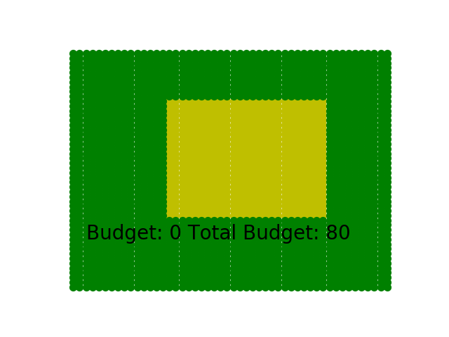
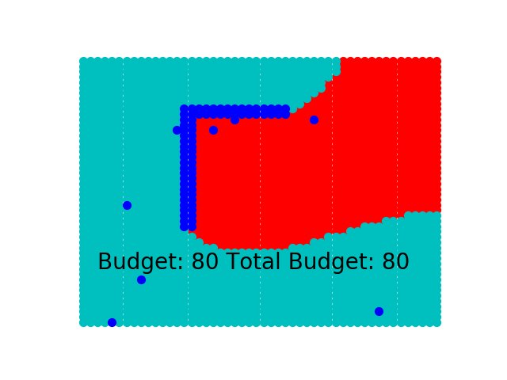
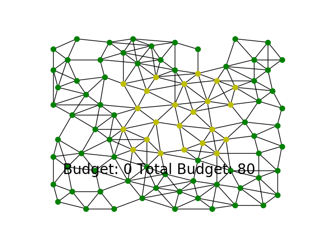
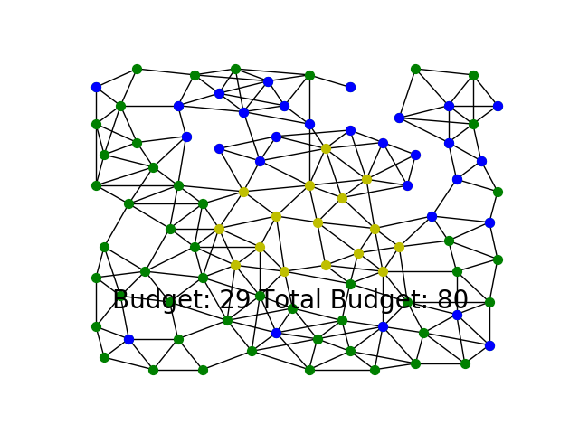
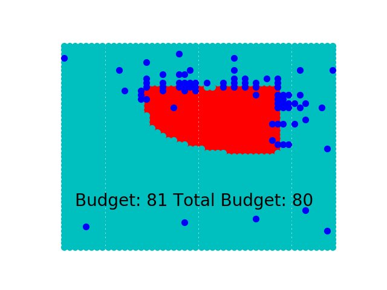
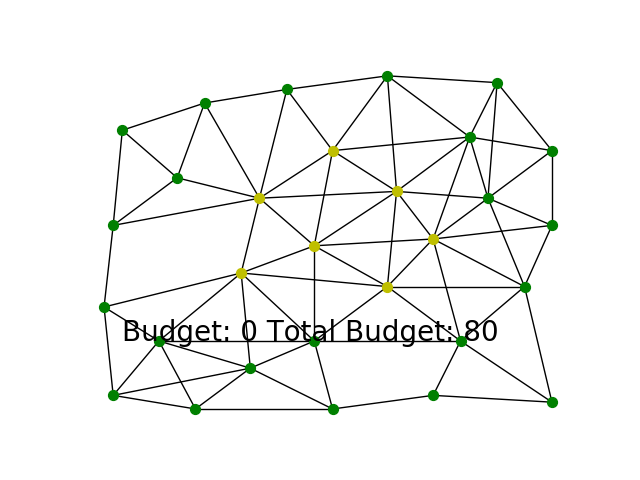
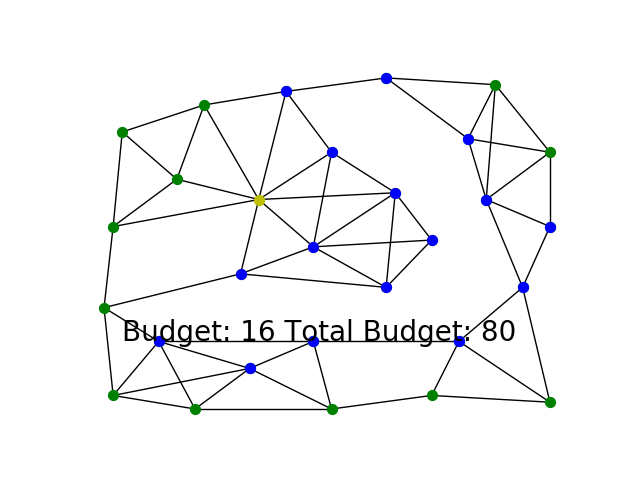
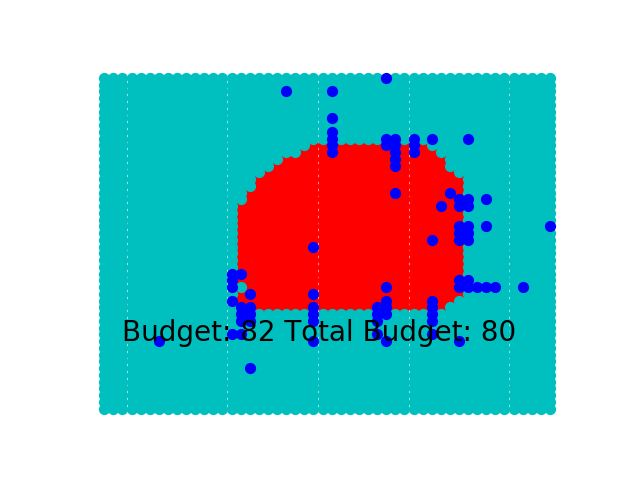

# S2-graph-based-Active-Learning
S2: An efficient graph based active learning algorithm with application to nonparametric classification

This is an implementation of the algorithm described in the paper: 
[S2: An efficient graph based active learning algorithm with application to nonparametric classification](http://proceedings.mlr.press/v40/Dasarathy15.pdf)

## Dependencies to run:
1. Python 3.6
2. Networkx 2.3

Preferably create an Anaconda virtual environment with these dependencies and run the code from it. 

## Original S2 algorithm
This is the original grid graph with the 2 colors representing different classes. The goal is to find the cut-set / decision boundary that separate the two classes. 
 

On applying the S2 algorithm as described by the paper, the following cut-set is discovered (dark-blue color nodes). Using these nodes, the ZLG algorithm is applied to predict the classes of the entire graph. The predicted classes are denoted by the red and light-blue colored nodes. Ideally, this graph should resemble the original graph shown above.  
 

As we can see, the "square" structure in the middle is not recovered properly. This is because S2 tends to become myopic once it discovers a cut edge and just "zips" through the decision boundary.

## Coarsened S2 algorithm
The idea is to first coarsen a given graph and then apply S2 on the coarsened graph. Once you find the cut-edges on the coarsened graph, project it onto the original graph and find the cut set on the original graph using the "repeated bisection" method. 

### Coarsening Strategy
V, U ---> {}

nodes ---> all nodes of the graph

%%% to sample nodes

while nodes is not empty:

  sample v from nodes
  
  add v to V 
  
  add k-hop neighbors of v to U
  
  nodes = nodes - V - U
  
%%% to add edges

for m in V:

  for n in V-m:
  
    add edge between m and n if they share a k-hop neighbor

### Instructions to run

Run coarsened_S2.py

set level=0 to not perform coarsening and run vanilla S2

### Results

#### Coarsen level 5
 
 
 

#### Coarsen level 10
 
 
 

