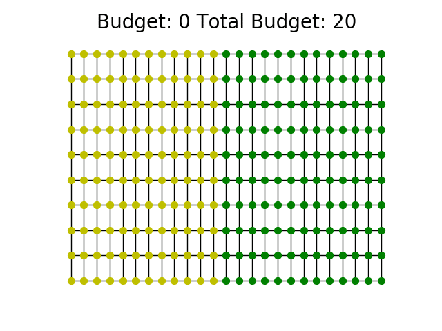
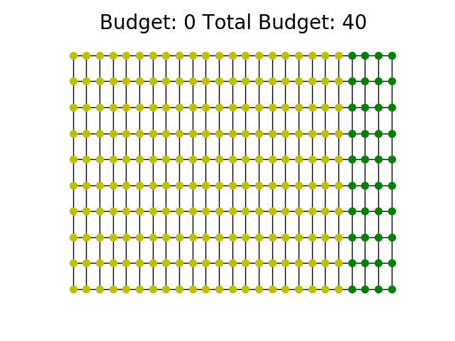
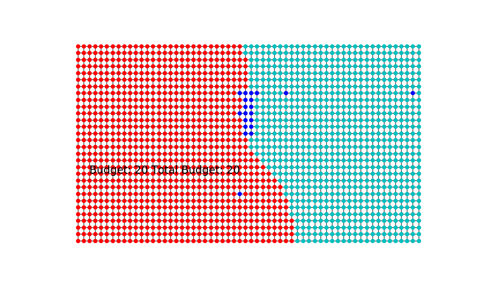
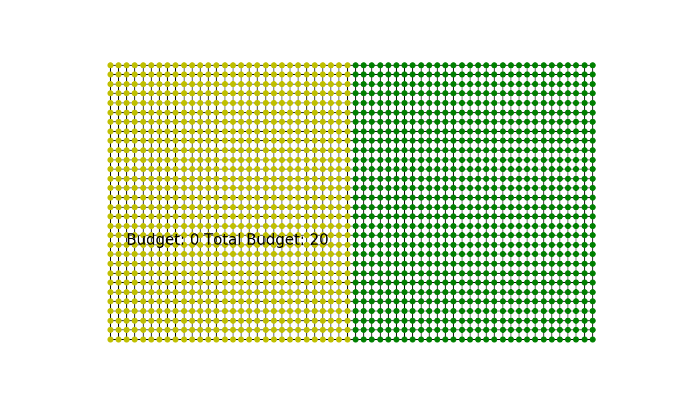
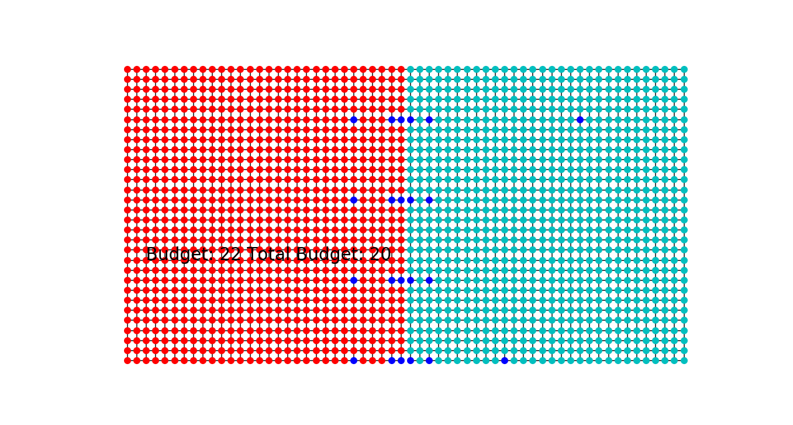

# S2-graph-based-Active-Learning
S2: An efficient graph based active learning algorithm with application to nonparametric classification

This is an implementation of the algorithm described in the paper: 
[S2: An efficient graph based active learning algorithm with application to nonparametric classification](http://proceedings.mlr.press/v40/Dasarathy15.pdf)

## Dependencies to run:
1. Python 3.6
2. Networkx 2.3

Preferably create an Anaconda virtual environment with these dependencies and run the code from it. 

## Original S2 algorithm
This is the original grid graph with the 2 colors representing different classes. The goal is to find the cut-set / decision boundary that separate the two classes. 
 

On applying the S2 algorithm as described by the paper, the following cut-set is discovered (dark-blue color nodes). Using these nodes, the ZLG algorithm is applied to predict the classes of the entire graph. The predicted classes are denoted by the red and light-blue colored nodes. Ideally, this graph should resemble the original graph shown above.  
 

As we can see, the "square" structure in the middle is not recovered properly. This is because S2 tends to become myopic once it discovers a cut edge and just "zips" through the decision boundary.

## Coarsened S2 algorithm
The idea is to first coarsen a given graph and then apply S2 on the coarsened graph. Once you find the cut-edges on the coarsened graph, project it onto the original graph and find the cut set on the original graph using the "repeated bisection" method. 

### Coarsening Strategy
V, U ---> {}

nodes ---> all nodes of the graph

%%% to sample nodes

while nodes is not empty:

  sample v from nodes
  
  add v to V 
  
  add k-hop neighbors of v to U
  
  nodes = nodes - V - U
  
%%% to add edges

for m in V:

  for n in V-m:
  
    add edge between m and n if they share a k-hop neighbor

Here is a trial run of the algorithm when both classes have almost equal number of elements. A Low budget is provided where its not possible to "zip" through the whole decision boundary. After S2 is run, the obtained boundary is then passed onto a label completeion algorithm as described in the paper.  

Here is the trial run of the algorithm when one class has more number of elements compared to the other and you are given a high budget. Here the algorithm has high enough budget to "zip" through the whole decision boundary. 

# Coarsened version of S2

When the graph is very big, S2 algorithm does not get a complete picture of the decision boundary as it can tend it to be very myopic. This is illustrated by performing S2 on a graph and feeding it to a label-completeion algorithm such as the [ZLG](http://mlg.eng.cam.ac.uk/zoubin/papers/zgl.pdf). We can notice that the prediction of labels tends to be very uneven:

 
The series of blue dots indicate the queried points when S2 is performed. 

The ground truth labelling is as below: 

However, when we coarsened the graph by 3 levels in this case, we observe that the the labels output by ZLG is much closer to the ground-truth and consequently captures the decision boundary in a better fashion. Coarsening is a very useful strategy when the budget is very less. It helps to get a "broader" picture of the decision boundary:

